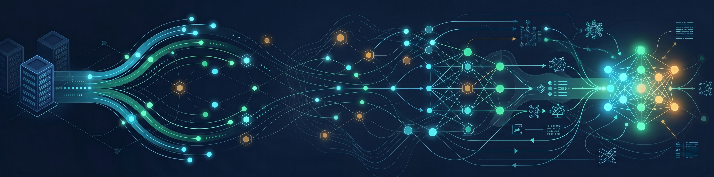

  <h1>Hi there, I'm Paulo Arthur Rocha 👋</h1>
  

    
  

  

    
    
  

---

### 🇺🇸 About Me

I'm a **Cloud & Platform Engineer** with 7+ years of experience architecting mission-critical infrastructure and AI-augmented platforms. Coming from government telecom networks (OSPF, L2/L3) and physical-to-cloud migrations, I now build **scalable full-stack SaaS** and orchestrate multi-LLM workflows on self-hosted infrastructure. I ship systems that turn AI agents into reliable engineering teams.

  
🇧🇷 Ler em Português

  
  Sou um **Engenheiro de Cloud e Plataforma** com mais de 7 anos de experiência arquitetando infraestrutura crítica e plataformas potencializadas por IA. Vindo de redes governamentais (OSPF, L2/L3) e migrações físico-nuvem, hoje construo **SaaS full-stack escaláveis** e organizo workflows multi-LLM em infraestrutura self-hosted. Meu foco é transformar agentes de IA em times de engenharia confiáveis.

---

### 🚀 Flagship Project

- 🤖 **[OneManAgency](https://github.com/pauloarthurrocha/OneManAgency)** — *Open-source framework for orchestrating AI agents across any IDE.*  
  
  
  - **What it does:** Turns Claude Code, Cursor, OpenCode, Windsurf, Aider, Roo Code & more into a full software factory with 17 specialized AI personas.
  - **Key innovations:** Context Engineering (state on disk, not chat RAM), PIV Loop (Plan → Implement → Validate with `/clear` between phases), 3-gate Review Triad (CEO → Eng → Design), TDD Iron Law for backend agents.
  - **Tech:** Cross-IDE (13 supported), zero-config MCPs (Context7, Playwright, Sequential Thinking, Memory), 9 playbooks, offline-first.
  - **Install:** `npm install -g onemanagency@latest`

---

### 📌 Featured Repositories

- ☁️ **[oci-platform-lab](https://github.com/pauloarthurrocha/oci-platform-lab)**: ARM64 dual-VPS OCI setup, Coolify, Docker, GitHub Actions CI/CD with security guard conditions.

- ⚙️ **[n8n-ai-workflows](https://github.com/pauloarthurrocha/n8n-ai-workflows)**: Advanced n8n workflow orchestrations with AI agents — multi-LLM automation patterns in production.

- 🧠 **[multi-llm-orchestration](https://github.com/pauloarthurrocha/multi-llm-orchestration)**: Patterns for multi-LLM workflows (Gemini + Claude Code + Perplexity + NotebookLM Context Kit) driving complex AI-assisted development.

---

### 🚀 What I'm Currently Building

- 🕵️‍♂️ **ScrapeFlow** — Competitive ad intelligence platform.  
  *(Stack: FastAPI, Next.js 16, PostgreSQL, pgvector, Redis, ARQ, Docker, OCI, Multi-LLM analysis)*  
  > 🔒 *Production SaaS. Private repo, available for technical discussion under NDA.*

---

### 📊 GitHub Stats

  
  

---

### 🛠️ Tech Stack & Arsenal

**Cloud, Infrastructure & DevOps**
 

**Backend & Architecture**
 

**Frontend**
 

**AI & Orchestration**
 

---

  <i>"You don't level up your code by saying please. You level up by building systems that forbid bad code."</i>

